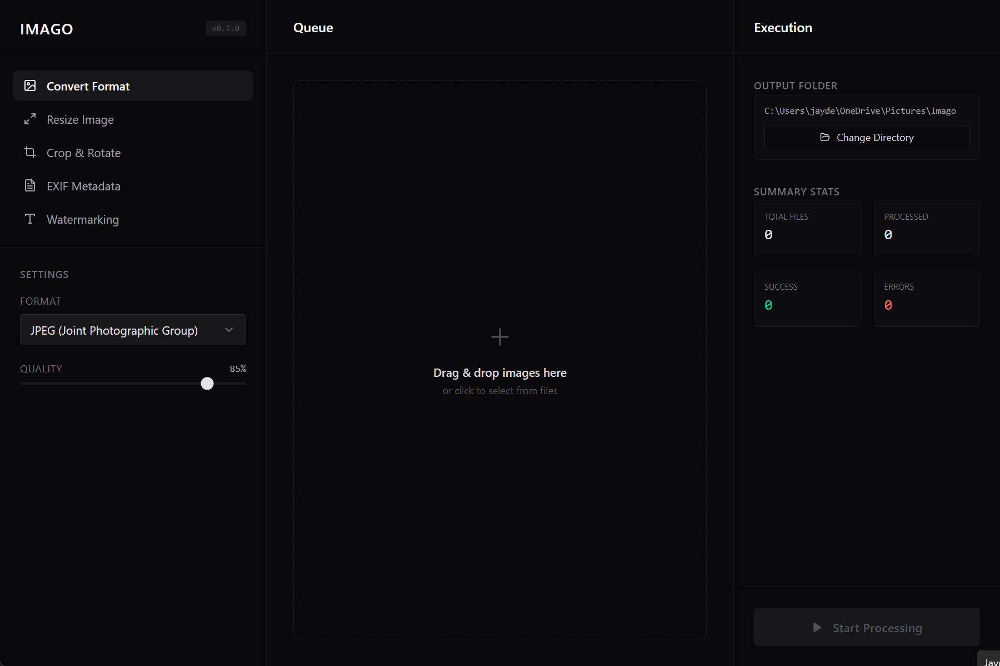

# IMAGO 🖼️
> **A free, open-source, and fully offline batch image processing utility.**

IMAGO is a premium desktop application built using the **Tauri v2** framework, combining a high-performance **Rust** engine on the backend with a sleek, responsive **React + TypeScript** frontend. 

Everything in IMAGO runs completely on your local machine—no telemetry, no clouds, and no privacy compromises.



---

## 🔮 The "Vibe Coded" Philosophy
This project is proudly **vibe coded**! That means it was built through high-velocity AI pair-programming and rapid iterations, merging the best of modern development practices with cutting-edge AI assistance. 

We love clean design, premium desktop vibes, and high-performance Rust internals. If you love shipping features and experimenting with new tech stacks, you'll feel right at home here.

---

## ✨ Features

*   **🔄 Convert Format**: Batch convert images between multiple formats (JPEG, PNG, WebP, AVIF, BMP, GIF, TIFF, ICO). Supports custom JPEG quality compression and optional black/white background fill for PNGs.
*   **📐 Resize Image**: Resize with precision. Supports Scale to Fit (Max Bounds), Exact Dimensions (Stretch), and Percentage-based scaling.
*   **✂️ Crop & Rotate**: Rotate images (90°, 180°, 270°) and draw custom crop boxes with live frontend bounds previewing.
*   **🏷️ EXIF Metadata**: Extract and inspect embedded EXIF metadata (camera models, aperture, shutter speed, date taken). You can also completely strip/wipe EXIF data to protect your privacy before sharing files.
*   **✍️ Watermarking**: Protect your work by adding customizable text overlays (size, opacity, color, position) or image overlays (custom paths, scale, opacity, alignment).
*   **⚡ High Performance**: Powered by a multi-threaded Rust backend using `rayon` for fast, parallel batch image processing that scales to all your CPU cores.
*   **📊 Summary Dashboard**: Track processing queues in real-time with progress status streaming, success/error rates, and automated batch statistics.

---

## 🛠️ Technology Stack

*   **Frontend**: React (v18), TypeScript, Tailwind CSS, Lucide Icons, Zustand (State Management)
*   **Backend**: Rust, Tauri v2
*   **Rust crates used**: `image` (fast decoding/encoding), `kamadak-exif` (metadata parsing), `imageproc` (processing utilities), `rayon` (parallelism), `tokio` (async runtime)

---

## 🚀 Local Development Setup

### Prerequisites
Before running or building IMAGO, you need to set up the Tauri v2 development environment:
1.  **Rust Toolchain**: Install Rust via [rustup](https://rustup.rs/).
2.  **Node.js**: Install Node.js (v18+ recommended).
3.  **System Dependencies** (mainly for Linux/Ubuntu):
    Refer to the official [Tauri Prerequisites Guide](https://v2.tauri.app/start/prerequisites/) for your operating system.

### Running in Development Mode
1. Clone the repository:
   ```bash
   git clone https://github.com/IamJayDeep/imago.git
   cd imago
   ```
2. Install dependencies:
   ```bash
   npm install
   ```
3. Run the application in development mode:
   ```bash
   npm run tauri dev
   ```

### Building the Production Bundle
To build a production installer for your current platform:
```bash
npm run tauri build
```

---

## 🤝 Contributing

We welcome contributions from anyone! Whether you're fixing a bug, adding a new image filter, improving the UI, or optimizing the Rust processing engine:

1.  **Fork** the repository.
2.  Create your feature branch: `git checkout -b feature/cool-new-feature`.
3.  Commit your changes: `git commit -m "feat: add cool new feature"`.
4.  Push to the branch: `git push origin feature/cool-new-feature`.
5.  Open a **Pull Request** and tell us about the vibes!

Please make sure to check for any unused variables or formatting issues before pushing, as our CI pipeline runs strict compilation and linting checks.

---

## 📄 License

This project is open-source and licensed under the **MIT License**. See the [LICENSE](LICENSE) file for the full text.
